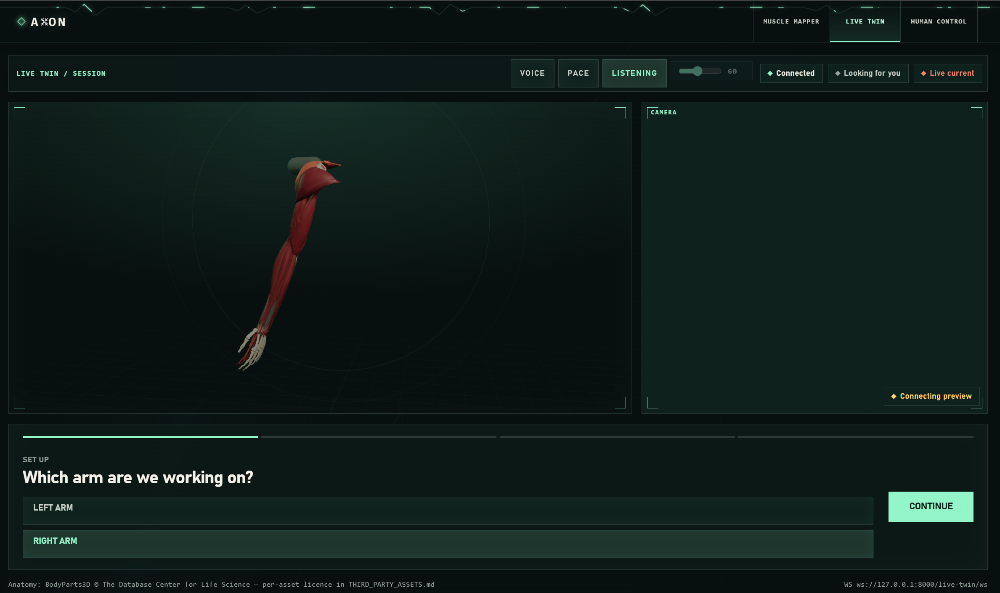

# Closed-Loop FES Arm Controller

Teleoperate a human arm with surface functional electrical stimulation (FES),
under closed-loop control from an external pose estimate.

An operator presses arrow keys; a PI controller compares the commanded joint
angles against the arm's measured pose and gates eight muscle-stimulation
channels until the real limb matches. Grip is a triggered power grasp.

> **This drives current through a person.** Read [`docs/SAFETY.md`](docs/SAFETY.md)
> before connecting anything to anybody. The safety limits are enforced on the
> microcontroller, deliberately independent of the control software.



*Live Twin. The muscle model on the left tracks the subject's real arm from the
camera on the right; the pads being driven are the ones you can see contracting.*

---

## Architecture

```
   keyboard (arrows / G / X)          voice ("bend the elbow")
            |                                   |
            v                                   v
   +--------------------------+          +---------------------------+
   |   PC  (controller/)      |          |  pose service (axon-main/)|
   |                          |          |  webcam -> MediaPipe ->   |
   |  target joint angles     |          |  3D landmarks -> angles   |
   |  PI control + mapping    |<---- 3D joints / angles, UDP :9090 --+
   |                          |                        |
   +-----------|--------------+                        | same angles
               |  duty[8] + grip, UDP :8080            v
               v                              +---------------------+
   +--------------------------+               |  3D twin (browser)  |
   |  ESP32-S3 (firmware/)    |               |  anatomical arm     |
   |  software PWM -> relays  |  <-- INDEPENDENT SAFETY LAYER        |
   |  watchdog / duty clamp   |               +---------------------+
   +-----------|--------------+
               |
        8 relay channels
               v
     2x AUVON AS8016 TENS/EMS  ->  electrodes  ->  muscles  ->  arm moves
                                                                   |
                    the camera sees the new position  <------------+
```

**The loop closes through the camera.** Stimulation moves the real arm; the
webcam sees the new position; MediaPipe turns that into joint angles; the
controller compares them against the target and adjusts the duty on each
channel. Nothing in that path knows what the arm was *told* to do — only where
it actually is. That is what makes it closed-loop rather than a timed sequence.

**The same angle stream drives the simulation.** The 3D anatomical twin in the
browser is fed from that identical measurement, so what you see on screen is
the arm's real posture and not a prediction. It is a viewer: closing the tab
changes nothing, and the twin cannot command the arm.

**Role split.** The PC decides *what the arm should do*. The ESP32 decides
*what is physically allowed*. The board never trusts the PC: if commands stop,
are malformed, or ask for too much, it clamps them or opens every relay.

---

## Repository layout

| Path | What it is |
|---|---|
| `firmware/` | MicroPython for the ESP32-S3 (actuation + safety) |
| `firmware/config/pins.py` | GPIO map, channel→muscle table, reserved-pin traps |
| `firmware/config/settings.py` | PWM timing + **safety envelope** |
| `firmware/lib/stim_channel.py` | One PWM-gated relay channel |
| `firmware/lib/stim_array.py` | The 8 channels + auto-off keep-alive |
| `firmware/lib/safety.py` | Arm/disarm, watchdog, duty clamping |
| `firmware/lib/wifi_manager.py` | Station-mode Wi-Fi + WebREPL |
| `tools/launch.py` | **One command: pose service + 3D twin + controller** |
| `tools/stop.py` | Stop leftover processes (frees the camera and ports) |
| `tools/deploy_wifi.py` | Wireless firmware deploy (no USB) |
| `tools/bench.py` | Interactive channel tester for hardware bring-up |
| `tools/calibrate.py` | Per-subject recruitment-curve sweep |
| `controller/` | PC-side control application |
| `controller/run.py` | Teleoperation entrypoint |
| `controller/control_loop.py` | The closed loop |
| `controller/pid.py` | PI controller (see docs for why not PID) |
| `controller/mapping.py` | Joint effort → 8 muscle channels |
| `controller/pose_api.py` | **Pose ingest API** (contract with teammate) |
| `controller/test_simulation.py` | Offline checks, no hardware needed |
| `axon-main/` | **Pose service** — webcam → MediaPipe → joint angles, over WebSocket and UDP |
| `webapp_demo/` | **The demo site.** Muscle Mapper, Live Twin and Human Control, one FastAPI app |
| `eleven_labs/` | Live Twin standalone: 3D anatomy, pad placement, conversational coach |
| `demo_lib/` | Screenshots and demo stills used in this README |
| `docs/` | Wiring, API contract, control design, safety, testing — [index](docs/README.md) |

---

## Quick start

### 0. Set up the virtual environment (once)

All Python commands in this project run inside a venv. From the repository root:

**Windows (PowerShell)** — use `py`, the Python launcher:

```powershell
py -m venv .venv
.venv\Scripts\Activate.ps1
py -m pip install -r requirements.txt
```

**Windows (cmd.exe):**

```cmd
py -m venv .venv
.venv\Scripts\activate.bat
py -m pip install -r requirements.txt
```

**macOS / Linux:**

```bash
python3 -m venv .venv
source .venv/bin/activate
python -m pip install -r requirements.txt
```

Your prompt should now start with `(.venv)`. **Re-activate it in every new
terminal** — the activate line only, not the `py -m venv` step.

#### `py` vs `python` on Windows

If your machine does not recognise `python`, use **`py`** (the Windows Python
launcher, installed with Python from python.org). You only strictly need it for
the `py -m venv` step above: **activating the venv puts `.venv\Scripts` on your
PATH, so `python` works inside an activated venv even when it fails outside.**

Check which you have:

```powershell
py --version           # should print a version
python --version       # may fail on your system - that's fine
```

Rule of thumb for every command in these docs:

| Situation | Use |
|---|---|
| Creating the venv (before activation) | `py -m venv .venv` |
| Inside an activated venv | `python ...` (works), or `py ...` if you prefer |
| Venv active but `python` still not found | `.venv\Scripts\python.exe ...` |

Verify after activating:

```powershell
python -c "import sys; print(sys.prefix)"     # should point inside .venv
mpremote --version
py -m esptool version
```

If `python` errors here, the venv is not actually active — re-run the activate
line and confirm the prompt shows `(.venv)`.

> If PowerShell blocks activation with an execution-policy error:
> `Set-ExecutionPolicy -Scope Process -ExecutionPolicy Bypass`

### 1. Dry run (no hardware, no estimator)

```bash
cd controller
python test_simulation.py     # 151 offline checks
python run.py --sim           # virtual arm, drive it with the arrow keys
```

### 2. Flash the board (USB, once only)

With the venv active, from the repository root:

Find your board's port first — it differs per machine and per USB socket:

```bash
mpremote connect list        # the ESP32 / USB-JTAG / CP210x line is your board
```

Flash the **standard** `ESP32_GENERIC_S3` MicroPython build (this board is an
N4R2 with *quad* PSRAM — not `SPIRAM_OCT`, and not the obsolete `FLASH_4M`).
Then:

```bash
mpremote fs mkdir :lib
mpremote fs mkdir :config
mpremote fs cp -r firmware/. :
```

The board then joins your hotspot and starts WebREPL. Unplug USB and power it
from the **5 V pin** — every later update is wireless:

```bash
python tools/deploy_wifi.py                    # auto-discover
python tools/deploy_wifi.py --host <board-ip>   # if discovery is blocked
```

(Auto-discovery needs inbound UDP through your firewall; `--host` always works.
The board prints its IP at boot.)

See [`docs/DEPLOY.md`](docs/DEPLOY.md).

### 3. Bench-test the hardware

Fire individual channels before any closed-loop run:

```bash
python tools/bench.py                    # auto-discover
python tools/bench.py --host <board-ip>  # if discovery is blocked
```

```
bench> arm
bench> pulse 1 0.7 3      # channel 1 at 70% duty for 3 seconds
bench> timer              # fire the auto-off keep-alive once
bench> off
```

### 4. Check the pose feed

Camera setup dominates everything downstream — repeated captures on one rig gave
elbow noise from 2.5° to 10.9° with no code change. Measure before closing the
loop on a person. `run.py` binds the pose port, so start the vision side
**without** the controller:

```bash
# terminal 1 - vision + 3D twin, pose port left free. Leave it open.
python tools/launch.py --pose-only

# terminal 2 - subject holds ONE posture still for 20 s
python tools/pose_noise.py
```

It saves every capture (angles *and* landmarks) so settings can be re-tested
with `--replay` instead of asking someone to sit still again, and `--label`
tags captures so physical setups can be compared. It tells you which of the
three distinguishable problems you have — broadband noise, tracking dropouts,
or a bad camera angle — and what to do about each. See `docs/CONTROL.md`.

You do **not** copy its recommended deadband anywhere: the controller measures
live noise and sizes its own.

### 5. Run for real

**One command brings up the whole pipeline** — pose service, 3D twin and
controller — and shuts it all down when you quit:

```bash
python tools/launch.py --no-board             # real pose, nothing stimulated
python tools/launch.py --host <board-ip>      # full system
```

Useful variants:

```bash
python tools/launch.py --sim                      # virtual arm, no hardware at all
python tools/launch.py --sim-hw --host <board-ip> # virtual arm, REAL relays
python tools/launch.py --min-visibility 0.7       # stricter landmark confidence
python tools/launch.py --no-open                  # do not open the twin in a browser
python tools/launch.py --verbose                  # show the pose service's own log
```

Or the controller alone, if the pose service is already running:

```bash
cd controller
python run.py                         # auto-discover the board
python run.py --host <board-ip>       # if discovery is blocked
```

Stop with `Q` in the launcher's terminal — closing browser tabs does nothing,
the browser is only a viewer. If a window was closed abruptly and something
still holds the camera or a port: `python tools/stop.py`.

### 6. The web app

The demo site is a separate FastAPI app that mounts all three surfaces on one
port. It manages its own environment with [uv](https://docs.astral.sh/uv/):

```bash
cd webapp_demo
copy .env.example .env        # cp on macOS/Linux; then fill in the keys
uv run uvicorn main:app --reload
```

Open <http://localhost:8000/>.

| Path | What it is |
|---|---|
| `/live-twin` | The 3D anatomical twin, camera preview and guided session (pictured above) |
| `/human-control` | Launcher for the closed-loop teleoperation session |
| `/ems-muscle-mapper` | Photo-based pad placement helper |

Pad firing from the web app is off by default and gated behind an environment
variable, because the conversational coach can trigger it and a misheard
command should not be able to stimulate anyone:

```bash
set AXON_PAD_FIRING=1         # Windows; export on macOS/Linux
uv run uvicorn main:app --reload
```

Only one process may hold the webcam. Human Control stops the in-browser loop
before starting the external session and vice versa — if a preview is stuck
offline, something else still owns the camera.

### Controls

One axis per key pair, each driving exactly one muscle pair:

| Key | Action | Muscle |
|---|---|---|
| `A` | **arm** — stimulation enabled (nothing moves until you press this) | — |
| `↑` | raise the arm (0–90°) | CH5 **middle** deltoid |
| `↓` | lower the arm | none — **gravity**, so it only works if already raised |
| `←` | swing **forward** | CH3 **anterior** deltoid |
| `→` | swing **back** | CH4 **posterior** deltoid |
| `W` | bend the elbow | CH1 biceps |
| `S` | straighten the elbow | CH2 triceps |
| `G` | **toggle grip** open/closed — it is `G`, **not Shift** | CH7 finger flexors |
| `D` | disarm |
| `X` | **EMERGENCY STOP** (latched; `A` to re-arm) |
| `?` | show the key list again |
| `Q` | quit (disarms on exit) |

Grip is `G` because a terminal cannot detect a bare Shift press or a key
release, so "hold to grip" is not implementable here. `G` toggles instead.

Boot state is **disarmed**. Nothing stimulates until you press `A`.

### Reading the status line

```
[ARM] bd:ok pose:OK e45/60 f10/30 a0/15 g:- CH1:0.70 CH3:0.48
```

Compact so it fits any terminal width; on a narrow window the least useful
fields drop first, so state and board flags stay visible.

| Field | Meaning |
|---|---|
| `[ARM]` / `[DIS]` / `[KIL]` | armed / disarmed / e-stopped |
| `bd:ok` | what the **board** reports about itself (see below) |
| `pose:OK` / `pose:STALE` / `SIM` | pose estimator feed |
| `e45/60` | elbow: **actual 45°, target 60°**. `f` = forward-back (+ is forward), `a` = elevation (how high the arm is) |
| `g:C` / `g:-` | grip closed / open |
| `noise:e4` | **only appears when the pose feed has degraded** — measured noise now exceeds that joint's deadband, so the arm will hunt around its target rather than sit on it. Check the camera, not the gains. |
| `CH1:0.70` | channels firing and duty. `idle` = nothing stimulating |

The controller stimulates until **actual** catches up to **target**; arrow keys
move the target.

**If nothing moves,** the state and `bd:` flags say why:

| Shows | Meaning |
|---|---|
| `[DIS]` | not armed — press `A` |
| `[KIL]` | e-stop latched — press `A` to re-arm |
| `pose:STALE` | no pose data. Use `--sim` for a virtual arm |
| `bd:LOST3s` | no heartbeat — Wi-Fi dropped or board off |
| `bd:REBOOTED` | the board restarted — press `A` to re-arm |
| `bd:NO-REPLY` | never heard from it — wrong IP or firewall |

Two more reasons a key can look dead — both are announced on screen:

- **At a joint limit.** `←` at abduction 0° cannot go lower, so `tgt` does not
  move. You will see *"shoulder_abd is already at its limit"*.
- **Inside the deadband.** Each arrow press is 3°, but the controller ignores
  errors under the **3° deadband** — that is what stops the arm buzzing at the
  setpoint. **Press an arrow twice before expecting movement.**

---

## Pin map — GPIO → relay → muscle

Board: **Axiometa Genesis Mini v1r2** (ESP32-S3-Mini-1-N4R2). Its 12 usable
GPIO come out on four AX22 ports; we use 10 of them.

| CH | GPIO | AX22 | Relay module / input | Muscle | Joint · role |
|----|------|------|----------------------|--------|--------------|
| 1 | **GPIO4** | P1.IO0 | Module 1 · IN1 | Biceps / brachialis | Elbow flex |
| 2 | **GPIO5** | P2.IO2 | Module 1 · IN2 | Triceps | Elbow extend |
| 3 | **GPIO6** | P2.IO1 | Module 1 · IN3 | Anterior deltoid | Shoulder flex |
| 4 | **GPIO7** | P2.IO0 | Module 1 · IN4 | Posterior deltoid | Shoulder extend |
| 5 | **GPIO15** | P3.IO2 | Module 2 · IN1 | Middle deltoid | Shoulder abduct (**gravity adducts**) |
| 6 | **GPIO16** | P3.IO1 | Module 2 · IN2 | *spare — unused* | — |
| 7 | **GPIO17** | P4.IO1 | Module 2 · IN3 | Finger flexors | Grip close |
| 8 | **GPIO18** | P4.IO2 | Module 2 · IN4 | Finger extensors | Grip release |

Module 1 drives TENS unit 1, Module 2 drives TENS unit 2. Two extra lines:
**GPIO2** (P1.IO2) → TIMER keep-alive relay across both units' TIMER buttons,
and **GPIO9** (P3.IO0) → hardware e-stop button, normally-closed to GND.

The on-board NeoPixel (**GPIO21**) shows firmware state — disarmed, armed,
stimulating, killed, link lost. Convenience only: it is never read by any
control or safety decision, and a green light is not permission to touch
anyone.

> **Ported from a Goouuu ESP32-S3-N16R8.** All eight channels and the timer line
> kept their GPIO numbers. The e-stop moved **GPIO8 → GPIO9**, because GPIO8 is
> battery sense on this board. The MicroPython image also changed: this is a
> quad-PSRAM **N4R2**, so it takes the **standard** `ESP32_GENERIC_S3` build,
> not `SPIRAM_OCT`.

Full wiring — power, the dummy-load resistor that prevents the turn-on jolt,
and electrode placement — is in [`docs/WIRING.md`](docs/WIRING.md).
Source of truth for pins: `firmware/config/pins.py`.

Antagonist pairs are **never co-contracted**. See [`docs/WIRING.md`](docs/WIRING.md)
for electrode placement.

---

## Documentation

**[`docs/README.md`](docs/README.md) is the index** — every document, and when
you'd want it. The ones you'll reach for first:

- [`docs/SAFETY.md`](docs/SAFETY.md) — **read first**; safety layers and procedure
- [`docs/MY_SETUP.md`](docs/MY_SETUP.md) — copy/paste commands for **this** machine,
  board and network (COM ports, board IP, firmware image). Day-to-day driver.
- [`docs/WIRING.md`](docs/WIRING.md) — relays, dummy load, jolt fix, electrodes
- [`docs/DEPLOY.md`](docs/DEPLOY.md) — Wi-Fi setup, wireless deploy, 5 V power
- [`docs/CONTROL.md`](docs/CONTROL.md) — why PI, tuning, loop timing
- [`docs/POSE_API.md`](docs/POSE_API.md) — the contract for the pose estimator
- [`docs/TESTING.md`](docs/TESTING.md) — bring-up order, bench checks

Subproject docs live with their code: [`webapp_demo/`](webapp_demo/README.md),
[`axon-main/`](axon-main/README.md), [`eleven_labs/`](eleven_labs/README.md).

## Scope

No intent detection, no EMG, no BCI. Targets come from the keyboard, from the
voice coach, or from a scripted exercise trajectory (future clinical app). Grip
is a gross power grasp, not individuated fingers.

Pose estimation is monocular RGB from a single webcam — no depth sensor, no
markers on the limb. That is why camera placement dominates everything
downstream, and why the controller measures its own noise floor rather than
trusting a fixed deadband.
